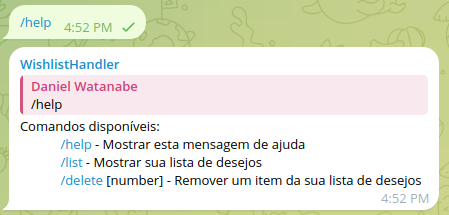
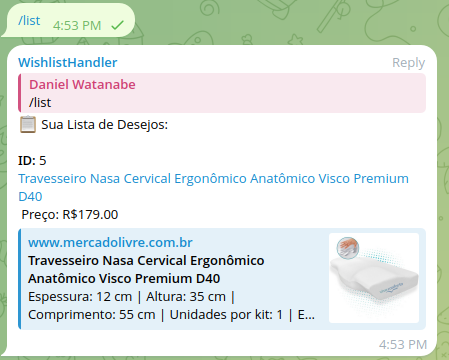
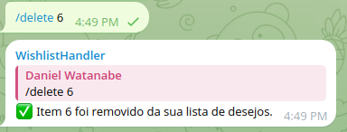
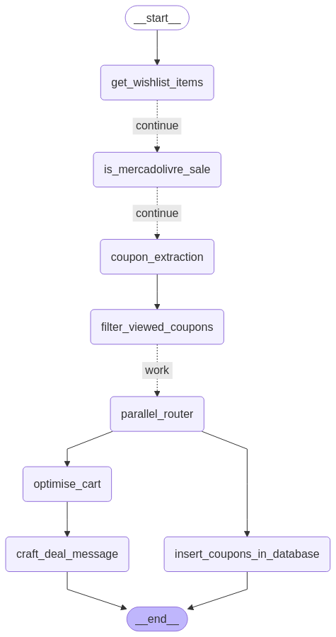

# Mercado Livre Wishlist & Coupon Listener Bot

A Telegram bot that listens for Mercado Livre product URLs, stores them in a PostgreSQL database. 
The bot allows you to manage your wishlist with simple commands and includes an intelligent agent that evaluates sales opportunities based on a group of sales messages.

## Features

- Automatically detects and saves Mercado Livre product URLs shared in a Telegram group
- Extracts product title and price information
- Provides commands to list and delete wishlist items
- Intelligent sales agent that evaluates coupons based on a group of sales messages and applies them to the user's wishlist, looking for best discount percentage.
- Stores data in a PostgreSQL database running in Docker

## Screenshots

### Wishlist Bot

#### Help Command



#### List Command



#### Delete Command



#### Adding item with mercado livre url


### Coupon received and applied to wishlist by the agent


## Requirements

- Python 3.8+
- Docker and Docker Compose
- Telegram account
- GROQ API key (for the sales analysis and final text generation)

## Setup Instructions

1. Clone this repository
2. Create a `.env` file based on `.env.example` with your credentials
3. Install dependencies:
   ```
   pip install -r requirements.txt
   ```
4. Start the database:
   ```
   docker-compose up -d
   ```
5. Start the bot:
   ```
   python run_bots.py
   ```

The first time you run the bot, it will prompt you to enter your phone number and the verification code sent to your Telegram account.

This happens because the listener client needs to be authorized to read messages from the group, that is only possible without the bot being admin if you use a user account.

The bot that sends the messages and listens to the wishlist group must be an admin of the group.

## Bot Commands

- `/list` - List all items in your wishlist
- `/delete [id]` - Delete an item from your wishlist by its ID
- `/help` - Show help message

## Sales Evaluation Agent

The project includes an intelligent agent powered by Groq's language models that analyzes messages received in a Telegram group and evaluates if there are coupons available in the message, then compares to the user's wishlist and applies the coupon to the items in order to get the best discount percentage.

### How the agent runs

The agent is a laggraph application thatruns through a workflow defined by a graph of nodes and edges. Each node represents a specific task, and the edges determine the flow between tasks. Here's a visual representation of the workflow:



The workflow follows these steps:

When a new message is received in the sales group:

1. Gets wishlist items from database
2. Checks if the message contains a Mercado Livre coupon if there are items in the wishlist
3. Uses a LLM to extract any coupons from the message, along with it's data and use conditions
4. Filters out previously seen coupons
5. If there are new coupons, in parallel:
   - Saves new coupons to database
   - Optimizes cart by applying coupons to wishlist items and uses AI to craft a message with the best deals found
6. Crafts a message with the best deals found


### Agent Configuration

1. Add all variables to the `.env` file
2. set the `SALES_GROUP` and `TEST_SALES_GROUP` variables to the Telegram group URLs
3. Set the `WISHLIST_GROUP_ID` variable to the ID of the Telegram group where the bot will save the wishlist items

## How to Use

1. Add the bot to a Telegram group and make it an admin
2. Share Mercado Livre product URLs in the group
3. The bot will automatically save these URLs to your wishlist using the postgres database along with the product name and price
4. Use the `/list` command to see all saved items
5. Use the `/delete [id]` command to remove an item by its ID

## Database Structure

The PostgreSQL database contains the schema present in init.sql
   - `coupons` - Stores all coupons found in the messages
   - `wishlist` - Stores all wishlist items
   - `telegram_messages` - Stores all messages from the Telegram group
